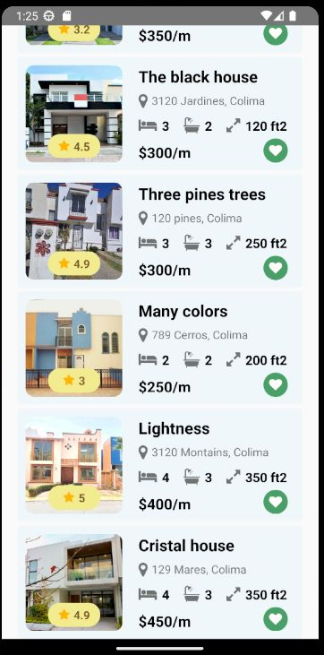

# Bootcamp

# App Inmobiliaria

- Table of contents
- Description.

This application help the Real estate companies to list their properties, with this application their clients can watch the available properties. The properties contains general information to describe their features, locations and price. 

- How to Install.
To install the project, open your terminal in this repository and go to path `./inmobiliariaApp`. Then, you run the command below `npm install`.

- How to run the Project.

To run this project open your terminal on the path `./inmobiliariaApp`. Then, run the command below `npx react-native start`. With this command you will open Metro. 

When Metro is open you type the letter `a` to run the App on an Android device, you can choose an Emulator or a physical device.

- How to Use the Project.

In this App you can see a list about properties for rent and their information. Also, you can select your favorites when you click on the like icon. 
In the image below you can see the UI of this App.

- Credits

-[BrightCoders](#-Bootcamp)

-[Antonio Ramirez](https://github.com/Antonio3veces3)

- Badges
